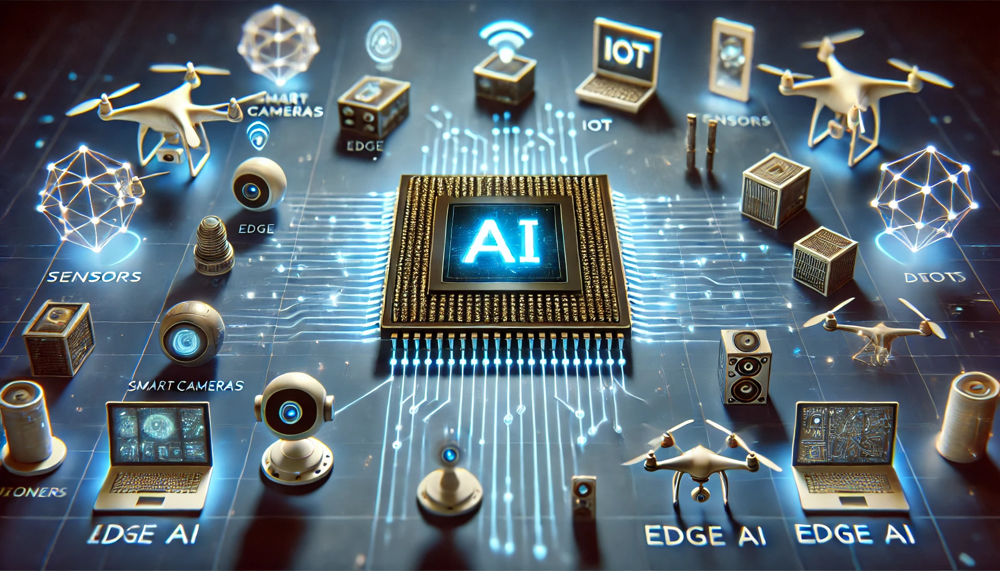

# AI-Accelerator for Edge AI Technical Notes

## Quick Reference
- AI accelerators are specialized hardware components designed to enhance AI and machine learning performance at the edge.
- Key use cases: Real-time processing, low-latency applications, IoT devices, autonomous systems.
- Prerequisites: Basic understanding of AI, edge computing, and hardware components.

## Table of Contents

- [Introduction](#introduction)
- [Core Concepts](#core-concepts)
- [Visual Architecture](#visual-architecture)
- [Implementation Details](#implementation-details)
- [Real-World Applications](#real-world-applications)
- [Tools & Resources](#tools--resources)
- [References](#references)

## Introduction

AI accelerators for Edge AI are specialized hardware components designed to improve the performance and efficiency of artificial intelligence algorithms on edge devices[9]. These accelerators enable AI processing directly on local edge devices, allowing for real-time data processing and analysis without constant reliance on cloud infrastructure[6].

## Core Concepts

### Fundamental Understanding

AI accelerators for Edge AI work by moving the most power-intensive parts of an AI model to specialized hardware[7]. This approach offers several benefits:

1. Increased computational speed
2. Reduced latency
3. Enhanced energy efficiency
4. Improved privacy and data security

Edge AI systems typically consist of four main elements:
- Edge devices (e.g., sensors, cameras, IoT devices)
- AI models optimized for edge hardware
- Specialized hardware (AI accelerators)
- Software frameworks for development and deployment[6]

### Visual Architecture

```mermaid
graph LR
    A[Edge Device] --> B[AI Accelerator]
    B --> C[Local Processing]
    C --> D[Real-time Decision Making]
    D --> A
```

## Implementation Details

### Basic Implementation

AI accelerators for Edge AI can take various forms, including:
- Graphics Processing Units (GPUs)
- Tensor Processing Units (TPUs)
- Application-Specific Integrated Circuits (ASICs)
- Field-Programmable Gate Arrays (FPGAs)[9]

These accelerators are designed to handle AI tasks efficiently on edge devices, enabling faster processing and decision-making without relying on cloud connectivity[8].

## Real-World Applications

Edge AI accelerators find applications in various industries:
- Autonomous vehicles
- Smart home devices
- Industrial IoT
- Healthcare monitoring systems
- Retail analytics

## Tools & Resources

### Essential Tools
- Edge AI development platforms (e.g., NVIDIA Jetson, Google Edge TPU)
- Edge AI software frameworks (e.g., TensorFlow Lite, ONNX Runtime)

### Learning Resources
- Online courses on edge computing and AI
- Hardware manufacturer documentation
- Edge AI community forums and blogs

By leveraging AI accelerators for Edge AI, developers can create more efficient, responsive, and secure AI applications that process data closer to its source, reducing latency and improving overall system performance[2][4].

## References
- [1] https://www.redhat.com/en/topics/edge-computing/what-is-edge-ai
- [2] https://www.wevolver.com/article/what-is-edge-ai
- [3] https://www.ibm.com/think/topics/ai-accelerator
- [4] https://xailient.com/blog/a-comprehensive-guide-to-edge-ai/
- [5] https://www.techtarget.com/searchenterpriseai/definition/edge-AI
- [6] https://www.scaleoutsystems.com/edge-computing-and-ai
- [7] https://xailient.com/blog/what-is-edge-ai-hardware-and-why-is-it-so-important/
- [8] https://www.geeksforgeeks.org/what-is-edge-ai-benefits-and-use-cases/
- [9] https://www.plainconcepts.com/ai-accelerator/
- [10] https://www.synopsys.com/glossary/what-is-an-ai-accelerator.html
- [11] https://www.supermicro.com/en/glossary/ai-accelerator
- [12] https://www.visionary.ai/blog/decoding-edge-ai-a-glossary-of-buzzwords